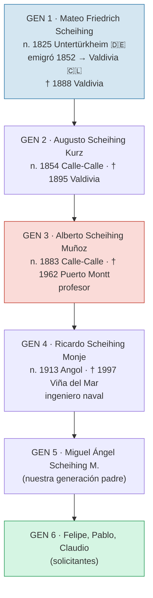
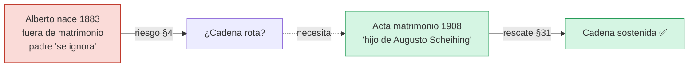
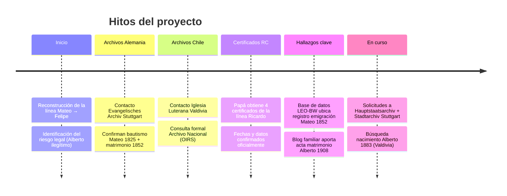
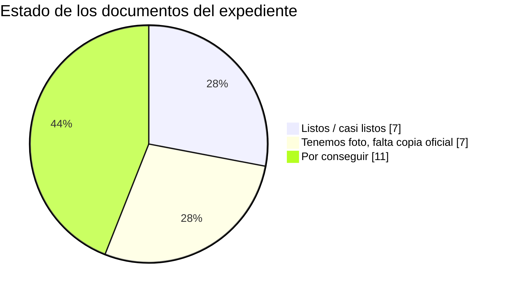

# 🇩🇪 Proyecto Ciudadanía Alemana por Descendencia — Familia Scheihing

> Documento resumen para la familia. Explica qué estamos haciendo, qué hemos
> logrado, qué documentos necesitamos y cómo van las gestiones.
>
> *Versión pública sanitizada — sin datos personales sensibles (RUN, folios,
> direcciones). La documentación completa se guarda en privado.*

---

## 🎯 ¿Qué estamos haciendo?

Tramitamos el reconocimiento de la **nacionalidad alemana por descendencia**
(§5 StAG) ante el **Bundesverwaltungsamt (BVA)** en Colonia, Alemania.

La idea: nuestro tatara-tatarabuelo **Mateo (Gottlob Friedrich) Scheihing**
nació alemán en 1825, emigró a Chile en 1852, y —si no renunció a su
nacionalidad— la transmitió por línea paterna directa hasta nosotros.

Si lo logramos, abre la puerta a la ciudadanía alemana (y europea) para los
descendientes directos.

---

## 🌳 La línea familiar (6 generaciones)

🔵 **GEN 1** = origen alemán (clave: probar que no renunció a su nacionalidad)
🔴 **GEN 3 (Alberto)** = el punto delicado del caso (ver más abajo)
🟢 **GEN 6** = nosotros, los solicitantes

---

## ⚖️ El desafío legal (en simple)

La ley alemana de la época (RuStAG 1870/1913) tiene una regla:

- **§4** → un hijo nacido **fuera del matrimonio** heredaba la nacionalidad de
  la **madre** (chilena), NO del padre alemán.

**El problema:** Augusto (GEN 2) y Rosario Muñoz (madre de Alberto) **nunca se
casaron**. Alberto nació en 1883 fuera del matrimonio. En el registro civil
chileno, los hijos de Rosario figuran con "padre: se ignora".

→ Riesgo: la cadena se "rompería" en la generación de Alberto.

**El rescate (§31 — legitimación):** descubrimos que en el **acta de
matrimonio de Alberto (1908)** él declara oficialmente ser **"hijo de Augusto
Scheihing y Rosario Muñoz"**. Eso es un reconocimiento civil del padre →
puede sostener la cadena.

---

## 📅 Cronología de avances

### Detalle de hitos

| Etapa | Qué se hizo | Resultado |
|-------|-------------|-----------|
| **1. Reconstrucción** | Armado del árbol Mateo→Felipe (6 generaciones) | Línea paterna directa confirmada |
| **2. Riesgo legal** | Análisis §4/§31 RuStAG | Identificado el punto crítico (Alberto 1883) |
| **3. Stuttgart eclesiástico** | Contacto archivo evangélico (Sra. Dengel) | Emiten bautismo 1825 + matrimonio 1852 + registro familiar |
| **4. Luterana Valdivia** | Contacto secretaría parroquial | Revisan libros antiguos (registros formales desde 1895) |
| **5. Archivo Nacional Chile** | Consulta formal por canal OIRS | Aclaran procedimiento de búsqueda histórica |
| **6. Certificados RC** | Papá obtiene 4 actas (línea Ricardo) | Nacimiento/matrimonio/defunción confirmados |
| **7. LEO-BW** | Búsqueda en base de datos de emigrantes de Baden-Württemberg | **Encontrado** el registro de emigración de Mateo (1852) |
| **8. Blog familiar** | Investigación del blog de Ricardo Scheihing G. | **Encontrada** foto del acta matrimonio Alberto 1908 (clave §31) |
| **9. Archivos estatales** | Solicitudes a Hauptstaatsarchiv + Stadtarchiv Stuttgart | Enviadas — esperando respuesta |

---

## 📋 Documentos requeridos y estado actual

Cada documento necesita 3 cosas para ser válido ante el BVA:
**(1)** copia oficial · **(2)** apostilla (Convenio de La Haya) · **(3)** traducción jurada al alemán.

### Núcleo de la cadena genealógica

| Documento | Generación | ¿Cómo estamos? |
|-----------|-----------|----------------|
| Nacimiento Felipe | 6 | 🟡 Falta versión oficial |
| Matrimonio padres | 5→6 | 🟢 Obtenido, falta apostilla+traducción |
| Nacimiento Miguel Ángel | 5 | 🟡 Falta versión oficial |
| Matrimonio Ricardo+Encarnación | 4→5 | 🟢 Obtenido |
| Nacimiento Ricardo | 4 | 🟢 Obtenido |
| Defunción Ricardo | 4 | 🟢 Obtenido |
| **Matrimonio Alberto 1908** ⭐ | 3→4 | 🟡 Tenemos foto, falta copia oficial |
| **Nacimiento Alberto 1883** ⭐⭐⭐ | 3 | 🔴 Por conseguir — *el más importante* |
| Defunción Augusto 1895 | 2 | 🟡 Tenemos foto |
| Nacimiento Augusto 1854 | 2 | 🟢 Tenemos versión oficial |
| Matrimonio Mateo+Elisa 1852 | 1→2 | 🟡 Tenemos foto (archivo alemán) |
| Bautismo Mateo 1825 | 1 | 🟡 Tenemos copia (archivo alemán) |

### Pruebas de apoyo (que no renunció a la nacionalidad)

| Documento | ¿Cómo estamos? |
|-----------|----------------|
| Expediente de emigración Mateo 1852 (Hauptstaatsarchiv) | 🟡 Ubicado, solicitado |
| Libro de ciudadanos de Untertürkheim (Stadtarchiv) | 🟡 Solicitado |
| Matrícula consular alemana en Chile (Mateo NO aparece) | ✅ La tenemos |
| Constancia de no-naturalización en Chile | 🔴 Por gestionar |

🟢 = oficial en mano (falta apostilla/traducción) · 🟡 = foto/copia no oficial · 🔴 = por conseguir

---

## 📨 Comunicaciones con instituciones

| Institución (país) | Para qué | Estado |
|--------------------|----------|--------|
| Evangelisches Archiv Stuttgart 🇩🇪 | Bautismo + matrimonio + registro familiar de Mateo | ✅ Respondió, emite documentos |
| Hauptstaatsarchiv Stuttgart 🇩🇪 | Expediente de emigración 1852 (¿renunció o no?) | 📤 Enviado, esperando |
| Stadtarchiv Stuttgart 🇩🇪 | Libro de ciudadanos + impuestos + herencia familiar | 📤 Enviado, esperando |
| Iglesia Luterana de Valdivia 🇨🇱 | Bautismo de Alberto (1883) | ✅ Revisando libros antiguos |
| Archivo Nacional de Chile 🇨🇱 | Búsqueda de naturalización / escrituras | ✅ Aclararon procedimiento |
| Embajada Alemana en Santiago 🇨🇱 | Lista de traductores jurados | ⏳ Por contactar |

---

## 🔜 Próximos pasos

1. **Conseguir el nacimiento de Alberto (1883, Valdivia)** — el documento que
   define todo el caso. Búsqueda en registro civil + iglesias de Valdivia.
2. **Copia oficial del matrimonio de Alberto (1908)** — la pieza que rescata
   la cadena. Pedible en cualquier Registro Civil de Chile.
3. **Apostillar y traducir** los certificados que ya tenemos.
4. **Respuestas de los archivos alemanes** (emigración + ciudadanía).
5. **Consulta con abogado** especialista en §5 StAG para validar la estrategia.

---

## 🤝 ¿Cómo puede ayudar la familia?

- **En Chile:** quien pueda acercarse a Registros Civiles o archivos en
  Valdivia / Santiago / Puerto Montt.
- **Documentos antiguos:** fotos de actas, certificados o libretas de familia
  que alguien tenga guardadas.
- **Memoria familiar:** nombres, fechas, historias de los ancestros —
  especialmente de Alberto y Augusto.

---

## 🙏 Agradecimientos

Gran parte de la historia familiar documentada aquí proviene del extraordinario
trabajo de **Ricardo Scheihing González** y su blog familiar, que reúne más de
50 capítulos sobre la familia Scheihing en Chile desde 1852.

---

*Proyecto coordinado por Felipe Scheihing. Documento generado como resumen
para la familia. La documentación detallada y los datos personales se mantienen
en privado.*
